# Advance Lane Finding
----
*Term 1, Project 4 of Udacity Self-Driving Car Nanodegree, by vuiseng9, August 2017* 

> 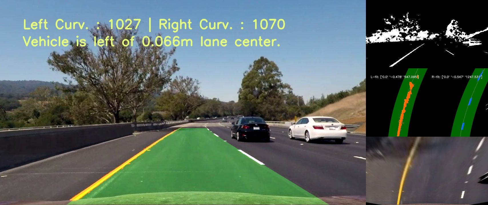

The goal of this project is to devise an OpenCV pipeline that identifies the lane boundaries in a video from a front-facing camera on a vehicle. The requirement of the pipeline includes camera calibration, several video frame transformation and filtering techniques to extract the lane pixels, and eventually forming the assumed quardratic lane boundary equations. The output of the project are videos compiled from frame processed by the pipeline where detected lane will be marked in color and computed details are printed as well. 

> [Complete codes in Jupyter notebook](https://github.com/vuiseng9/SDCND-P002-Traffic-Sign-Classifier/blob/master/submission/Traffic_Sign_Classifier.ipynb).

> [Final Project Video](www.youtube.com) and [Final Challenge Video](www.youtube.com)

Following sections explain the stages of pipeline and design considerations to address the project specifications. It is important to note that the code snippets included in this writeup is not explicit as only the essential codes are presented to convey the key ideas. Please refer the ipynb for complete codes.

---

#### Camera Calibration

In practice, each camera has its imperfect characteristics that result in unique distortion in its 2d captured images. To reflect the real world vision, images need to be corrected so that correct and useful information can be analyzed out of them. Undoing distortion requires camera calibration, a non-recurring process to compute the correction factors that will be applied to all frames captured by the same camera. In this project, a set of chessboard images are provided for this purpose. As the chessboard are known with square pattern, the distorted square corners of a series of chessboard images can be mapped to the corners in practice to extract the correction factors. These functions are provided by OpenCV APIs below.

```python
# Find the chessboard corners
ret, corners = cv2.findChessboardCorners(gray, (9,6),None)

# Draw and display the corners
img = cv2.drawChessboardCorners(img, (9,6), corners, ret)
```
```cv2.findChessboardCorners``` is fed with tuple of (9,6), indicating the expected corners in the chessboard, this function will return the coordinates of the corners in the image if 9x6 corners are found. Using the returned coordinates and ```cv2.drawChessboardCorners```, chessboard patterns can be visualized as diagram below. Notice that 3 images are blank as the API is not able to detect 9x6 corners. That is okay, we have enough corners to compute the correction factors.
> 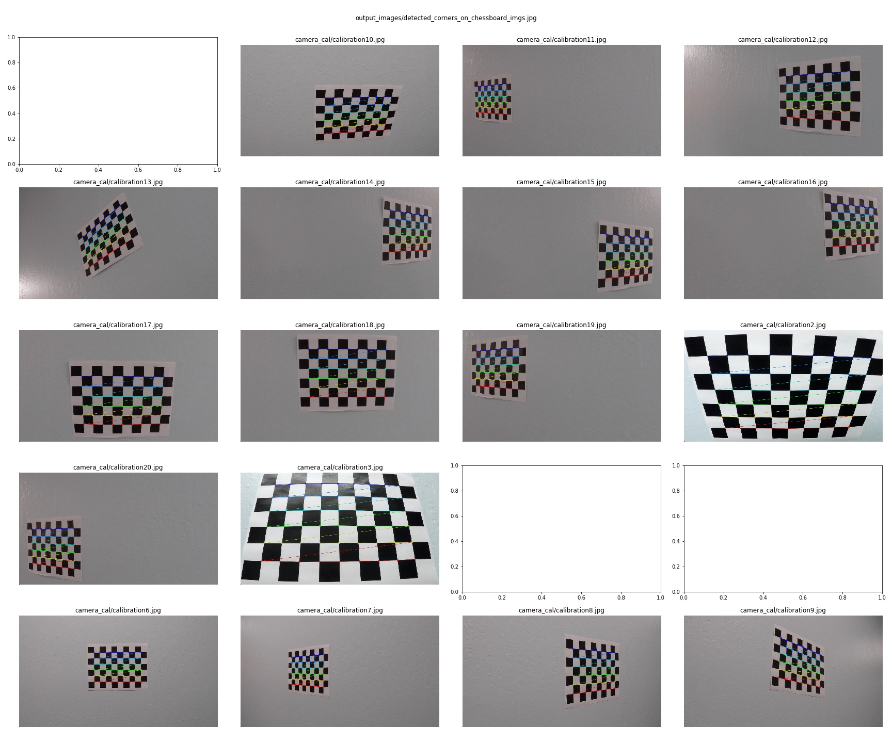

Next, we need to form the coordinates of the corners in 3d world. First, let's imagine that the chessboard is laying on a flat surface where each square has edges of a unit length. Mapping the corners to an x,y,z plane, and since it is on flat plane, z will always be 0, therefore, the 3d coordinates will be [0 to 8, 0 to 5, 0]. 
```python
# forming corner coords in 3d world
# prepare object points, like (0,0,0), (1,0,0), (2,0,0) ....,(6,5,0)
objp = np.zeros((6*9,3), np.float32)
objp[:,:2] = np.mgrid[0:9,0:6].T.reshape(-1,2)
```
Now, we have the real-world corners and the corners detected in the images, we can use ```cv2.calibrateCamera``` function to calculate the correction factors. 
```python
# Do camera calibration given object points and image points
 ret, mtx, dist, rvecs, tvecs = \
        cv2.calibrateCamera(objpoints, imgpoints, img.shape[::-1][1:],None,None)
```

Of all the returned values, only calibration matrix (```mtx```) and distortion coefficient (```dist```) are required for our pipeline. They are saved using ```pickle``` package and they will be restored in the undistortion step in the pipeline.

----

#### Distortion Correction

After obtaining the calibration parameters, it is straightforward to rectify the images by plugging target image, together with the ```mtx``` and ```dist``` to the ```cv2.undistort``` API.
```python
# Apply undistortion to sample image 
# with the calibration parameters obtained above
undist = cv2.undistort(img, mtx, dist, None, mtx)
undist2 = cv2.undistort(img2, mtx, dist, None, mtx)
```
Presenting below are two distortion corrected examples:
> 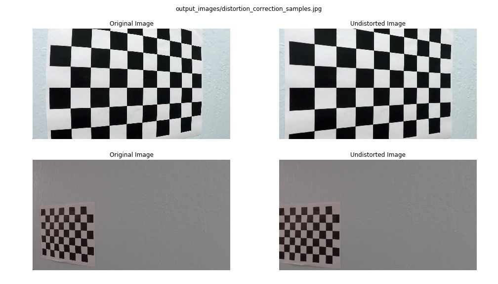
Notice that the checker boxes appeared bended initially are straightened after the correction.

----

#### Color Space Transform and Masking

The next step in the pipeline is color space transform and masking. The objective is to create a binary thresholded image where most of the details are masked out other than the lane boundaries. In my opinion, it is the key determining step in this project to give satisfactory lane detection. The design considerations of the function ```mask_color``` are as following. 
1. **Color space transform from RGB to HLS**
    ```python
    # Convert to HLS color space
    hls_img = cv2.cvtColor(img, cv2.COLOR_RGB2HLS)
    ```
   As we explored in the tutorial, HLS color space is more intuitive to specify the color through the hue(H) channel, color intensity by the saturation(S) channel and the amount whiteness (brightness) by the luminance(L) channel. Color space conversion is handy with ```cv2.cvtColor``` where users only need to provide the identifier of the source and destination color space, i.e cv2.COLOR_RGB2HLS in the case here.

2. **Color Boundary Masking**
   > 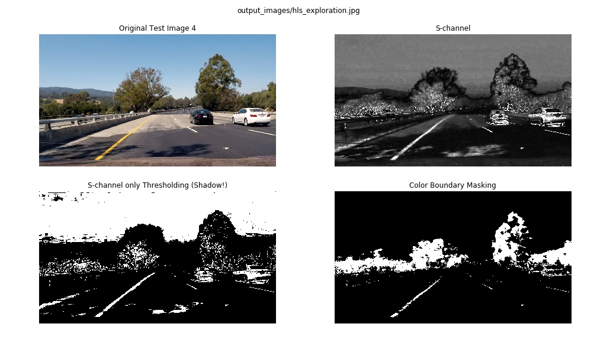
    
   Although we learned that S channel is good to select yellow lines. However, by just using it alone may not be sufficient as you can tell, in S-channel of test image 4, the tree shadow looks to be in the values close to the yellow lines. If we were to only threshold S-channel, the shadow is not masked out and will cause spurious lane detection later on. 
   > 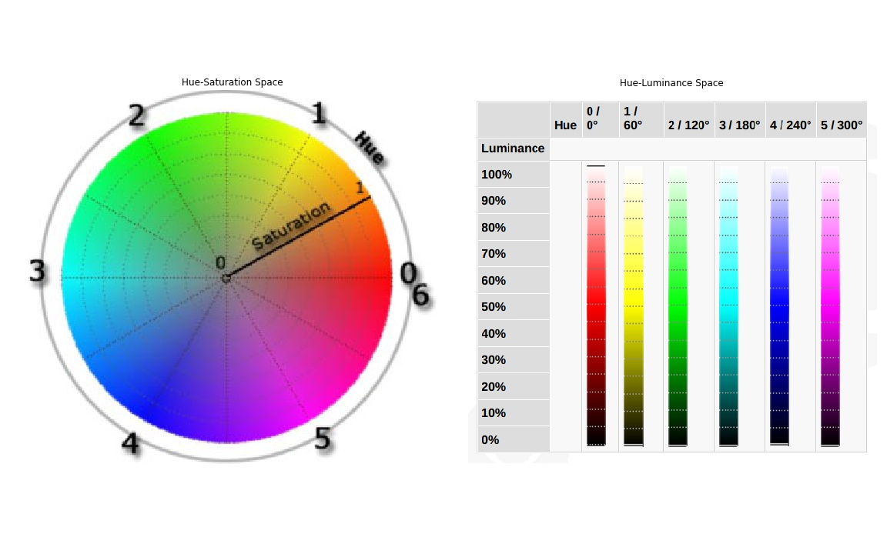
   > [source: www.chaospro.de](http://www.chaospro.de/documentation/html/paletteeditor/colorspace_hsl.htm)
 
   This is when color boundary comes into picture, instead of utilizing a single channel, 3 channels need to be simultanenously used to filter only the yellow lines. But we know that there are going to be variation in yellow color values, we need to create the upper and lower limit in each H, L, S channel that only pixel values falling into these 3 regions are the valid pixels to retain. So how to do we determine the upper and lower limit value? Two diagrams above can help us. Clearly, yellow is at 60 degree in the Hue circle, the limit for H will be a tolerance around that, 60/360*128 = 22 (allowed value of H is from 0-127). From the luminanse diagram, we would like to have a complete range as they look yellow. As for saturation, we want to avoid low saturation because the pixel would look somewhat grey regardless of the other two channels, shadows may be introduced again. With that, after iterations of fine tuning, the final boundary values for HLS are H:20-35, L:0-255, S:40-255. How about white lines? We will use only the L-channel, because it is a measure of amount of white itself.

    ```python
    # placeholder for hls mask
    hls_mask = np.zeros_like(hls_img[:,:,0], dtype="uint8")
    
    # Loop to mask for every upper-lower boundary pair
    for (lower, upper) in hls_boundaries:
        # create NumPy arrays from the boundaries
        lower = np.array(lower, dtype = "uint8")
        upper = np.array(upper, dtype = "uint8")
        
        # masking using cv2.inRange function
        mask = cv2.inRange(hls_img, lower, upper)
        
        # add the binary to previous binary image
        hls_mask = hls_mask | (mask == 255)
        
    # extract l-channel from hls image
    l_channel = hls_img[:,:,1] 
    
    # l-channel thresholding
    l_binary = np.zeros_like(l_channel)
    l_binary[(l_channel >= l_thresh[0]) & (l_channel <= l_thresh[1])] = 1    
    
    # Bitwise OR on hls masked output and l-channel thresholded output
    combined_binary = (hls_mask | l_binary)
    ```
   It is simple to implement the color boundary filtering using ```cv2.inRange```, a list of lower limit and a list of upper limit of each channel serve as input parameters. The function is designed for multiple color boundaries. here is the output of each test image after color masking.
    > 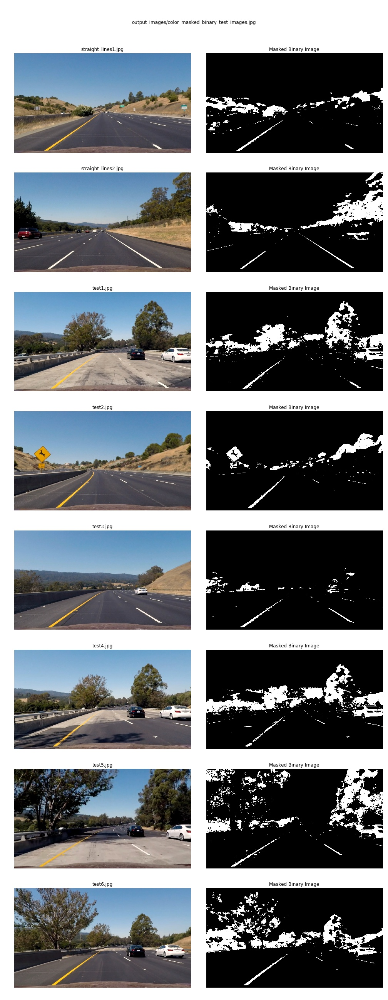

3. **Omission of Gradient Thresholding**

   It is decided to drop the gradient thresholding as it does not improve the lane detection in the project and challenge video. In fact, in the challenge frames (diagram below), it amplifies the edges of divider shadow and road patches and they introduce false points to be fitted on the polynomial.
   > 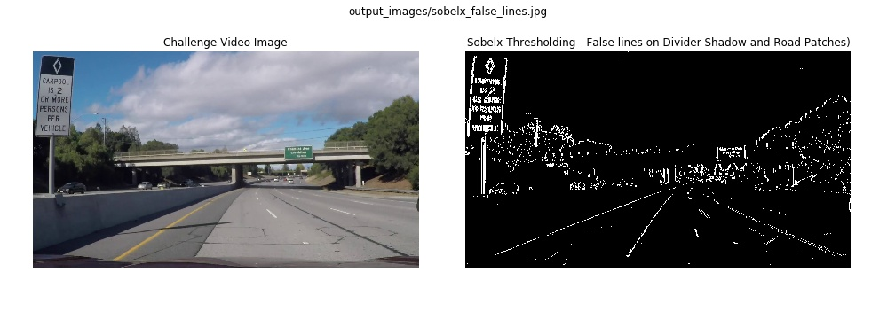

----

#### Transform from Single-point Perspective to Aerial view 

At this point of the pipeline, we have a binary image where lane lines should be vividly retained for the next step. However, if we look closely, curved lines may seem not much of a curve at times. This is mainly due to the nature of single-point perspective of front-facing camera, even two parallel lines will converge at a vanishing point. To overcome the challenge of fitting polynomial in this perspective, a transformation to aerial view is required.
```python
# default parameters are tuned for project variables
def transform_aerial_view(img,  
                          trapeziod_vertices = [trapezoid_ul, trapezoid_ur, trapezoid_lr, trapezoid_ll],
                          aerial_vertices = [bbox_ul, bbox_ur, bbox_lr, bbox_ll]):
    
    image = np.copy(img)
    
    # Convert list of src and dst vertices into np float array
    src = np.asarray(trapeziod_vertices, dtype= np.float32)
    dst = np.asarray(aerial_vertices, dtype= np.float32)

    # Compute transformation matrix
    M = cv2.getPerspectiveTransform(src, dst)
    
    # Apply transformation matrix to input image
    warped = cv2.warpPerspective(image, M, (img.shape[1],img.shape[0]),flags=cv2.INTER_LINEAR)

    return warped
``` 
Essentially, framing a straight parallel lane boundaries as a trapezoid in single-point perspective should appear as a rectangular box in the bird-eye view. With this knowledge, a transformation matrix ```M``` is first computed through ```cv2.getPerspectiveTransform``` where source is a list of trapezoid vertices and destination is a list of four corner coordinates of a box. ```M``` is subsequently applied to the target image using ```cv2.warpPerspective```. ```cv2.INTER_LINEAR``` is choosen as it is a simple interpolation strategy for warping and less overhead in latency.

Below is the results of aerial view transformation on the masked test images:
> 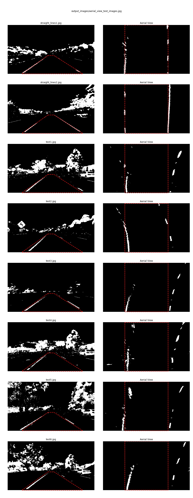

----

#### Lane Detection and Fitting

With the bird-eye view, we are ready to map out the lane lines. As function defined are inherited from the tutorial, a complete function code snippet is attached and it is self-explanatory with code comments. A gif is enclosed for conceptual visualization. In summary, a histogram is formed for the bottom half of the bird-eye view to identify the left and right boundary. Subsequently, the frame is sliced into rows and window search is started from the identified peaks, ascending row by row to the top. White pixels within the window margin are stored for fitting later on and window search are re-centered based on the these white pixels. In the project and challenge video, as the lane appears to look like quadratic function, the detected white pixels are used to fit a polynomial of degree 2 using numpy ```np.polyfit```.  

> 

The function also includes look-ahead filter feature to avoid blind window search when it is supplied with a historical fit coefficient. It will in turn perform the targeted search marginally around the provided fit like diagram below.

> 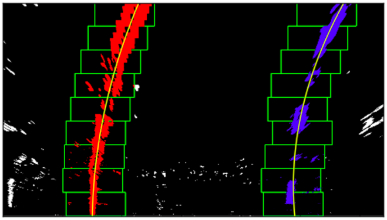

Note that other robustness techniques will be covered in a later section. Meanwhile, following is the code snippet of function ```detect_and_fit_lane```.
```python
def detect_and_fit_lane(binary_warped, left_fit=None,right_fit=None):
    # Identify the x and y positions of all nonzero pixels in the image
    nonzeroy, nonzerox = binary_warped.nonzero()
    
    # Set the width of the windows +/- margin
    margin = 100
    
    # Set minimum number of pixels found to recenter window
    minpix = 50    
    
    # Create empty lists to receive left and right lane pixel indices
    left_lane_inds = []
    right_lane_inds = []
        
    # None for both left and right fit is the value
    # to perform a new sliding window search (histogram-based)
    # scenarios such as:
    #     first frame of the video or
    #     when a consecutive drop of bad fitting
    if left_fit is None and right_fit is None:
        
        # compute histogram along all the columns in the lower half of the image
        histogram = np.sum(binary_warped[binary_warped.shape[0]//2:,:], axis=0)
        
        # Find the peak of the left and right halves of the histogram
        # as the starting point for the left and right lines
        midpoint = np.int(histogram.shape[0]/2)
        leftx_base = np.argmax(histogram[:midpoint])
        rightx_base = np.argmax(histogram[midpoint:]) + midpoint

        # Choose the number of sliding windows
        nwindows = 9
        
        # Set height of windows
        window_height = np.int(binary_warped.shape[0]/nwindows)

        # Current positions to be updated for each window
        leftx_current = leftx_base
        rightx_current = rightx_base
  
        # Step through the windows one by one
        for window in range(nwindows):
            # Identify window boundaries in x and y (and right and left)
            win_y_low = binary_warped.shape[0] - (window+1)*window_height
            win_y_high = binary_warped.shape[0] - window*window_height
            win_xleft_low = leftx_current - margin
            win_xleft_high = leftx_current + margin
            win_xright_low = rightx_current - margin
            win_xright_high = rightx_current + margin

            # Identify the nonzero pixels in x and y within the window
            good_left_inds = ((nonzeroy >= win_y_low) & (nonzeroy < win_y_high) & 
                              (nonzerox >= win_xleft_low) & (nonzerox < win_xleft_high)).nonzero()[0]
    
            good_right_inds = ((nonzeroy >= win_y_low) & (nonzeroy < win_y_high) & 
                               (nonzerox >= win_xright_low) & (nonzerox < win_xright_high)).nonzero()[0]

            # Append these indices to the lists
            left_lane_inds.append(good_left_inds)
            right_lane_inds.append(good_right_inds)

            # If you found > minpix pixels, 
            # recenter next window on their mean position
            if len(good_left_inds) > minpix:
                leftx_current = np.int(np.mean(nonzerox[good_left_inds]))
            if len(good_right_inds) > minpix:        
                rightx_current = np.int(np.mean(nonzerox[good_right_inds]))

        # Concatenate the arrays of indices
        left_lane_inds = np.concatenate(left_lane_inds)
        right_lane_inds = np.concatenate(right_lane_inds)
   
    else:
        # When the function is provided with with left and right fit coeefficient
        # no sliding window search is performed, the function performs targeted
        # search around the fitted line coordinates
        left_lane_inds = ((nonzerox > (left_fit[0]*(nonzeroy**2) + left_fit[1]*nonzeroy + left_fit[2] - margin)) & (nonzerox < (left_fit[0]*(nonzeroy**2) + left_fit[1]*nonzeroy + left_fit[2] + margin))) 
        right_lane_inds = ((nonzerox > (right_fit[0]*(nonzeroy**2) + right_fit[1]*nonzeroy + right_fit[2] - margin)) & (nonzerox < (right_fit[0]*(nonzeroy**2) + right_fit[1]*nonzeroy + right_fit[2] + margin)))  
    
    # Extract left and right line pixel positions
    leftx = nonzerox[left_lane_inds]
    lefty = nonzeroy[left_lane_inds] 
    rightx = nonzerox[right_lane_inds]
    righty = nonzeroy[right_lane_inds] 

    # Fit a second order polynomial to each line
    if len(leftx) == 0:
        left_fit = None
    else:
        left_fit = np.polyfit(lefty, leftx, 2)
    
    if len(rightx) == 0:
        right_fit = None
    else:
        right_fit = np.polyfit(righty, rightx, 2)

    return left_fit, right_fit, (leftx, lefty), (rightx, righty)
```
----

#### Lane Curvature and Vehicle Position

As provided in the project guide, the curvature radius of any point x in the function x = f(y) = Ay^2 + By + C is:

> 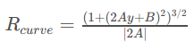

Slightly modified from the tutorial, the function ```compute_lane_curvature``` defined here only takes the left and right line fitted coefficient with no left and right detected coordinates to avoid storing and passing many variables. The coefficients needs to be converted to the meter space before feeding to the curvature equation. Ideally, we can derive transformation factor to translate the coefficients to meter space. However, an attempt has failed and it could be due to underflow or overflow issue or simply the derivation was wrong. To workaround that, the line fit x and y positions are re-computed with the coefficients, they are then refitted after thier conversion to meter units. It is not an optimized solution but it serves the purpose for now. The final returned radius is an average of radius computed at every point on the line.

The function also computes the vehicle location relative the lane center. As we assume that the front-facing camera is mounted at the center of the vehicle, the difference, at the bottom of image, between the center of the image and the midpoint of the two lines is the distance of the vehicle center to the lane center. By the convention defined here, positive offset means vehicle is at the right of lane center and negative value means otherwise.

```python
def compute_lane_curvature(left_fit, right_fit):
    # Define conversions in x and y from pixels space to meters
    ym_per_pix = 30/720 # meters per pixel in y dimension
    xm_per_pix = 3.7/900 # meters per pixel in x dimension

    # Construct all x,y for left and right boundary
    ploty = np.linspace(0, image.shape[0]-1, image.shape[0])
    left_fitx = left_fit[0]*ploty**2 + left_fit[1]*ploty + left_fit[2]
    right_fitx = right_fit[0]*ploty**2 + right_fit[1]*ploty + right_fit[2]
    
    # Convert to meter units and Fit new polynomials 
    left_fit_cr = np.polyfit(ploty*ym_per_pix, left_fitx*xm_per_pix, 2)
    right_fit_cr = np.polyfit(ploty*ym_per_pix, right_fitx*xm_per_pix, 2)
    
    # generate a vector of y pixels for calulation
    y_eval = np.linspace(0, image.shape[0]-1, image.shape[0])
    
    # Calculate the new radii of curvature in meters
    left_curverad = ((1 + (2*left_fit_cr[0]*y_eval*ym_per_pix + left_fit_cr[1])**2)**1.5) / np.absolute(2*left_fit_cr[0])
    right_curverad = ((1 + (2*right_fit_cr[0]*y_eval*ym_per_pix + right_fit_cr[1])**2)**1.5) / np.absolute(2*right_fit_cr[0])
    
    # Calculate the vehicle offset to the center of lane
    lane_centerx = right_fitx[-1] - left_fitx[-1]
    vehicle_offset = (640 - lane_centerx) * xm_per_pix
    
    # return the mean radius and vehicle offset to the center of the lane
    return left_curverad.mean(), right_curverad.mean(), vehicle_offset
```
----

#### Warping lane boundaries and Final Visualization

Alright! All math computations are done at this point, time to visualize and draw the lane boundary, print calculated values. Two functions ```mark_lane``` and ```transform_single_point_perspective``` are implemented.

```mark_lane``` basically colors the detected left lines in red, blue for the right lines. It also draws the fitted quadratic lines in yellow and shades the search area in green. The function is adapted from the tutorial, adding a functionality that draw the search boundary in yellow whenever a historic fit is used, this is particular useful for pipeline debugging.

```transform_single_point_perspective``` can be deemed as a reversal process of ```transform_aerial_view```, with addition of detected lane blended on the original image. It uses ```cv2.fillPoly``` to fill a green color on pixels within the left and right boundary. It then uses ```cv2.warpPerspective``` to obtain the transformation matrix, the only thing now is that the source shape is the rectangular box and destination shape is the trapezoid. Finally, the warped lane is overlaid on top of the undistorted image via ```cv2.addWeighted```.


IMHO, it seems trivial to attach the codes as the major portion of the codes are provided in the guide. Please find [here](ipynb) if you'd like the details. Now, the final output of test images are shown.
> 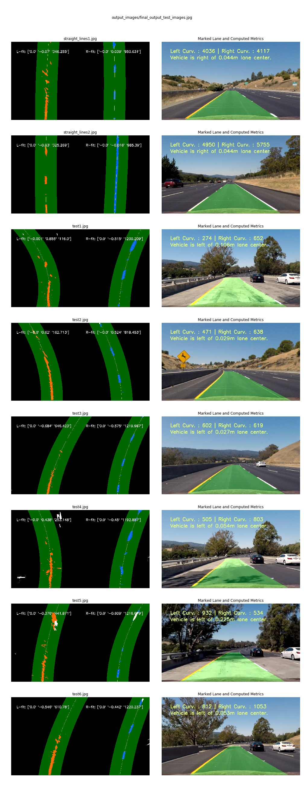
----

#### Robustness Design

This section mainly discussed the implemented robustness to achieve stable result in project and challenge video. It is much accredited to the "Tips & Tricks" in the project manual.
1. A ```Line``` object is implemented to store all the line attributes, especially historical fitted values. 
   ```python
   # Define a class to receive the characteristics of each line detection
   class Line():
       def __init__(self):
           # was the line detected in the last iteration?
           self.detected = False  
           
           #polynomial coefficients averaged over the last n iterations
           self.best_fit = None  
           
           # storage of fit coefficients of the last n iterations
           self.previous_fits = []
           
           # polynomial coefficients for the most recent fit
           self.current_fit = None  
           
           # radius of curvature of the line in some units
           self.radius = None 
           
           # difference in fit coefficients between last and new fits
           self.diffs = np.array([0,0,0], dtype='float') 
           
           # x, y of detected line pixels
           self.allxy = (None, None)  
           
           # count of consecutive bad fitting
           self.drop_count = 0
   ```

2. Coefficient Smoothing
   
   To stabilize the lane boundary, the best fit coefficient is created, which is an average of historical fit coefficient, it effectively dampens the lane boundary changes. The smoothing factor is the number of historical fit value to store and to be averaged. 
   ```python
   # the number of historical fit to be stored
   smoothing_factor = 12
   ```
   Following are the logics of storing the historical fit list ```Line.previous_fits``` and averaging using ```np.mean```.
   ```python
   # Discard the first element of the history list to 
   # to make room for recent fit coeff.
   if len(left_line.previous_fits) == smoothing_factor:
       left_line.previous_fits.pop(0)
       right_line.previous_fits.pop(0)
   
   # Append recent fit coeff. to the history list
   left_line.previous_fits.append(left_line.current_fit)
   right_line.previous_fits.append(right_line.current_fit)        
   
   # Smooth out the coeff. averaging all the value in history list
   if len(left_line.previous_fits) == 1:
       left_line.best_fit = left_line.previous_fits[0]
       right_line.best_fit = right_line.previous_fits[0]
   else:
       left_line.best_fit = np.vstack(left_line.previous_fits).mean(axis=0)
       right_line.best_fit = np.vstack(right_line.previous_fits).mean(axis=0)
   ```

3. Sanity check, fit drop and reset histogram window search.

   So how do we know if a fitting is a defect? We will always benchmark the best fit, to keep it simple, we catch a defect if the linear coefficient has changed more than a specified threshold. The intuition is that it is easy to tune the threshold value as the linear component is the gradient of straight line, you can imagine that how a straight line would change with respect to the gradient.
   ```python
   # change threshold to reject a fitting
   linear_coeff_threshold = 0.3
   ```
   When a fit is dropped, a previous fit will be used as fit for current frame as it is assumed that, at least for the two videos here, no drastic changes between two consecutive frames. 
   ```python
   # Compute the difference between the current fit coef. and the best fit coef.
   if i > 0:   
       left_line.diffs = left_line.current_fit - left_line.best_fit
       right_line.diffs = right_line.current_fit - right_line.best_fit
   
   # Drop the current fit and use the previous fit coeef 
   # if the linear coeff is over a specified threshold
   # otherwise, current fit is good to go
   # the number of consecutive drop is recorded
   if np.absolute(left_line.diffs[1]) > linear_coeff_threshold:
       left_line.current_fit = left_line.previous_fits[-1]
       if left_line.detected == False:
           left_line.drop_count += 1
       left_line.detected = False
   else:
       left_line.detected = True
       left_line.drop_count = 0
       
   if np.absolute(right_line.diffs[1]) > linear_coeff_threshold:
       right_line.current_fit = right_line.previous_fits[-1]
       if right_line.detected == False:
           right_line.drop_count += 1
       right_line.detected = False
   else:
       right_line.detected = True
       right_line.drop_count = 0
   ```
   Notice that in the snippet above, there is a drop counter, it is accounting the number of consecutive of bad fit. A threshold parameter is also created to tweak the number of drops before a new histogram-based lane search. It is simple to trigger a new search by not supplying any fit coefficient (setting to ```None```, as explained in the ```detect_and_fit_lane``` function.
   ```python
   # the number of consecutive drop threshold to initiate new search
   window_reset_threshold = 3 
   ```
   ```python
   # When a consecutive of drop has reached the specified threshold
   # a complete new sliding window search is executed.
   if (left_line.drop_count >= window_reset_threshold) | \
      (right_line.drop_count >= window_reset_threshold):
       # reset the drop count
       left_line.drop_count = 0
       right_line.drop_count = 0
       
       # New window search
       left_line.current_fit, right_line.current_fit, left_temp, right_temp = \
           detect_and_fit_lane(binary_warped, None, None)
       
       # There are chances new window search are not usable,
       # previous fit is used instead
       if (left_line.current_fit is None):
           left_line.current_fit = left_line.previous_fits[-1]
       else:
           left_line.allxy = left_temp
           
       if (right_line.current_fit is None):
           right_line.current_fit = right_line.previous_fits[-1]
       else:
           right_line.allxy = right_temp
           
       left_line.detected = True
       right_line.detected = True
       
       # Clear all the historical fit since a new fit is used
       left_line.previous_fits = []
       right_line.previous_fits = []
   ```
----

#### Results and Discussions

With the described steps and techniques, the lane detection in the project video is performing reasonably well and decent in the challenge video. These videos are first being processed to output as a series of jpg images using vid2imgs.py scripts. The processing pipeline coded in a single cell in the notebook reads in the images jpg by jpg, performs the detection and writes out a final marked and labelled jpg output. The complete collection of output jpgs are then compiled at 25 fps as final video using ```moviepy.editor``` package.

**Final Project Video** - Throughout the video, the line fitting is straightforward as the route is either straight or curving in a uniform pattern. The challenge to overcome is when the vehicle traverses through different road quality, that is transition between brighter surface and darker surface, and also tree shadow (00:20-00:25, 00:37-00:42). The lane lines on brighter surface are faded, causing some bad fitting. With the robustness implementation, the lane detection pipeline here is able to drop defect and use previous best fit and mark acceptable lane. Recovery from consecutive bad frame can also be noticed.

**Final Challenge Video** - It is important to note that some parameters has been modified to enable decent lane detection in this video. First, the yellow & white HLS limits from project video are not applicable here because of the weather lighting condition, hence, they are re-tuned. The lane is curvier and the initial trapezoid to bird-eye view transformation needs to be adjusted and steeper linear coefficient change is allowed. At the 00:05-00:09 span when the vehicle is going underneath a flyover, the pipeline is not able to perform lane detection because the lane lines are basically not visible. Recovery is also slow because there is a response time of the camera to adjust its exposure when it is coming out from dark area. Other than the flyover area, the rest of the video is okay.

**Challenges for Lane Detection Generalization**
1. How could the quality of all frames be standardized/calibrated across different time of the day and weather and visibility?
2. The trapezoid to bird-eye view transformation is actually key to determine the curvature. It is very sensitive where a few pixel difference could result is a huge measurement difference.
3. Deciding on the order of polynomial is also a challenge because in the "harder challenge video", it seems to be a polynomial of order 3
4. How do we go about when a vehicle is right in front blocking the single point perspective?
5. How about at urban road conditions where lane marks are not proper at times?

There are many more practical challenges to overcome and at this point, I start to appreciate deep learning techniques when feature maps can be trained from vast data of different scenarios to extract the lane boundary and also other hidden layers that is robust enough to generalize.

